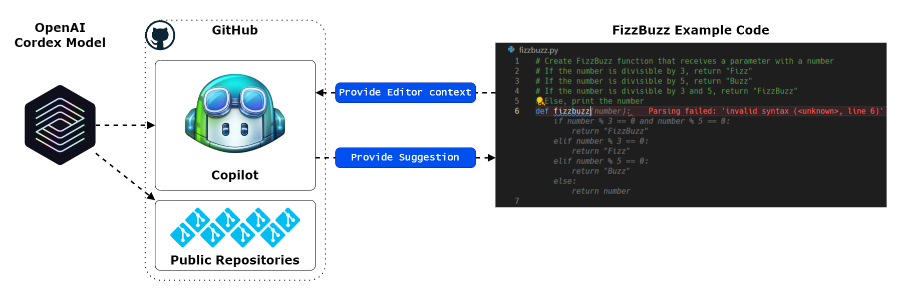
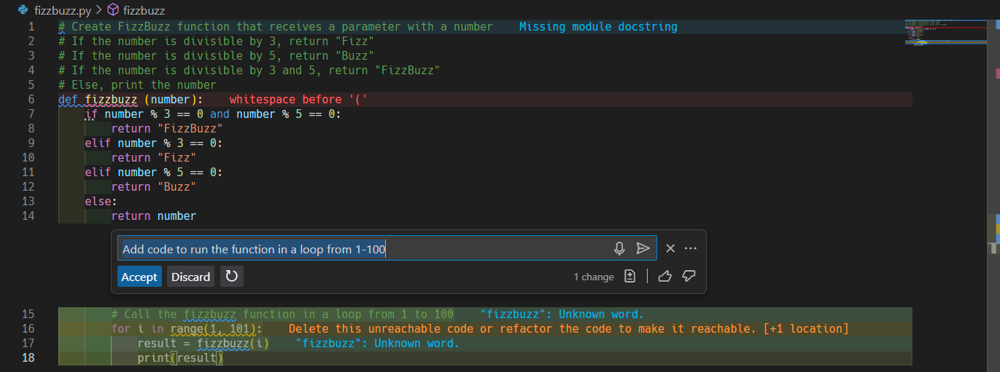
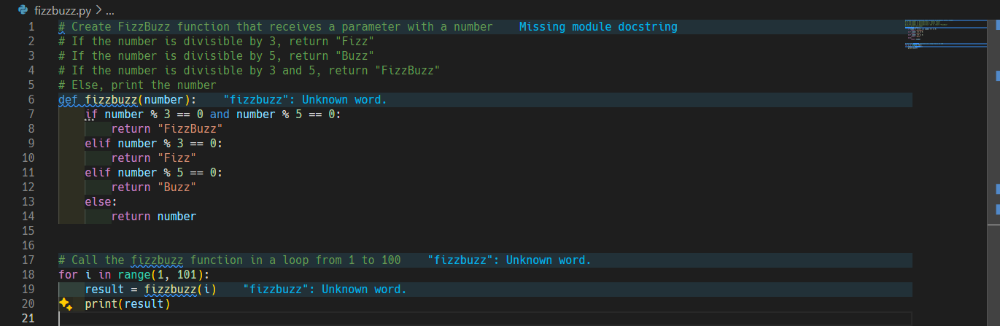
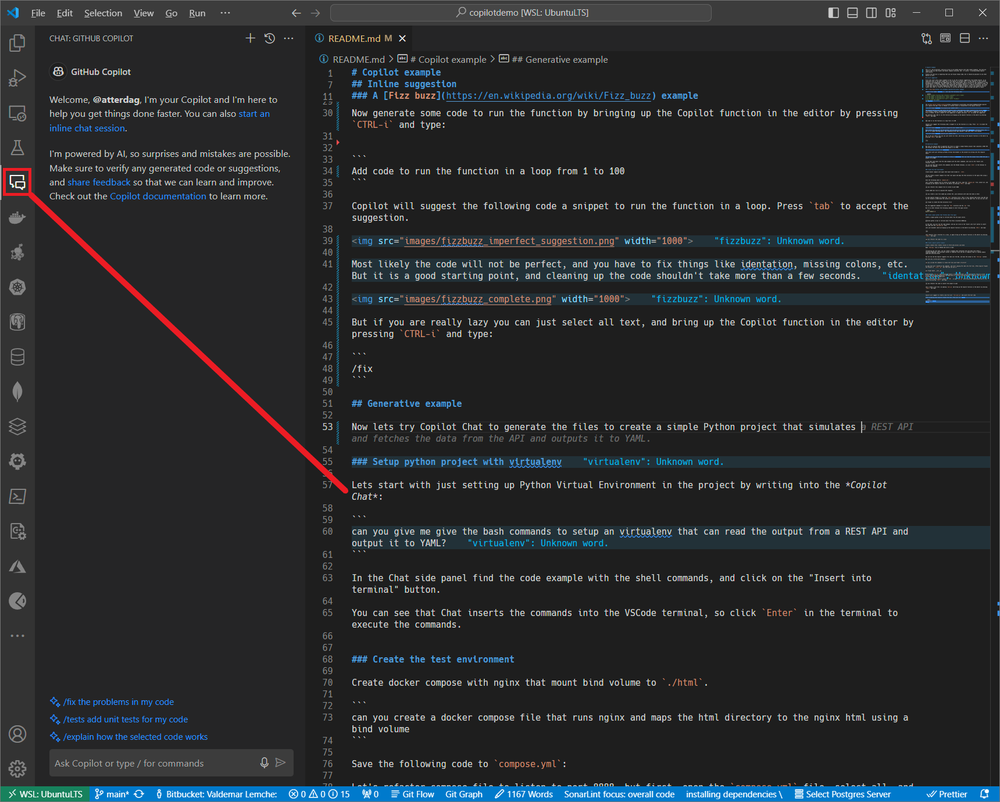
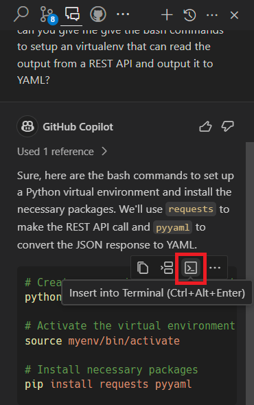
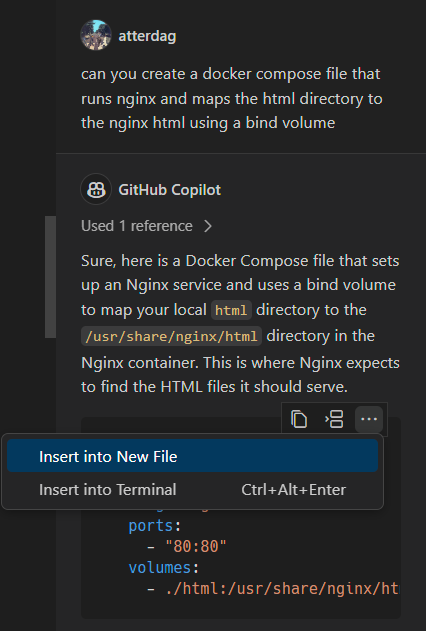
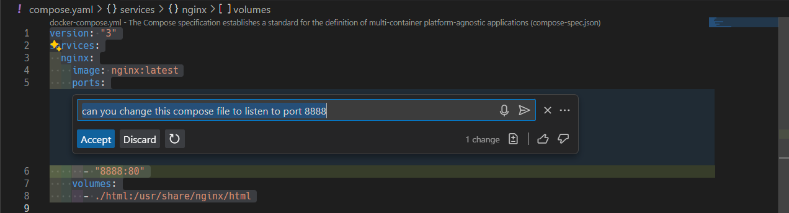
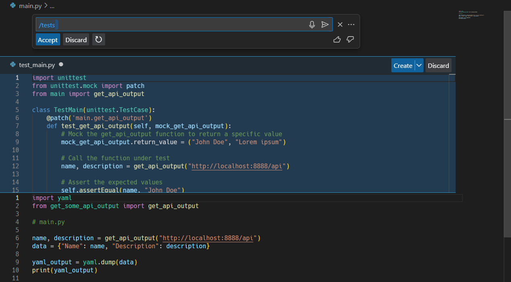

# Copilot example

This is a _do-it-yourself_ exercise on how to use GitHub Copilot with some simple examples. The exercise require that you have Docker and Docker Compose installed, and - of course - a working GitHub Copilot subscription.

Finally the exercise is expecting that you use Visual Studio Code, but it should be possible to use other editors as well.

## Inline suggestion

First lets start with a basic example on how to use the in-editor suggestions from GitHub Copilot. In my experience this is the most common way to use Copilot in my daily work, in that Copilot is just silently working in the background and suggesting next lines being Python code or Structurizr DSL statements or even documentation in Markdown. Copilot simply just frees up mental capacity to focus on the problem at hand. Of course there is a risk that Copilot will manipulate the thought process in a specific direction, but often I find that Copilot will make suggestions that I hadn't thought of myself, and as such expand my horizon rather than limit it. After all in the end I'm the one who decides what to accept and what to reject.

### A [Fizz buzz](https://en.wikipedia.org/wiki/Fizz_buzz) example

Create a file named `fizzbuzz.py`, and copy the following code:

```python
# Create FizzBuzz function that receives a parameter with a number
# If the number is divisible by 3, return "Fizz"
# If the number is divisible by 5, return "Buzz"
# If the number is divisible by 3 and 5, return "FizzBuzz"
# Else, print the number
def fizzbuzz
```

The [GitHub Copilot VSCode extension](https://marketplace.visualstudio.com/items?itemName=GitHub.copilot) will capture the open files in VSCode in a Context which is transmitted to the Copilot Service.



The Copilot Service will then match the Context with a Code Reference Index created by the [OpenAI Cordex model](https://openai.com/blog/openai-codex), delete the Context, and send back a suggestion to the open file in VSCode. So wait a moment for the suggestion to appear and press `tab` to accept the suggestion.

Now generate some code to run the function by bringing up the Copilot function in the editor by pressing `CTRL-i` and type:


```
Add code to run the function in a loop from 1 to 100
```

Copilot will suggest the following code a snippet to run the function in a loop. Press `tab` to accept the suggestion.



Most likely the code will not be perfect, and you have to fix things like identation, missing colons, etc. But it is a good starting point, and cleaning up the code shouldn't take more than a few seconds.



But if you are really lazy you can just select all text, and bring up the Copilot function in the editor by pressing `CTRL-i` and type:

```
/fix
```

## Generative example

Now lets try Copilot Chat to generate the files to create a simple Python project that simulates a REST API and fetches the data from the API and outputs it to YAML.

But first ... where is the Chat? By default you find it as a panel on the left sidebar in VSCode, but you can always move to the right sidebar as I actually prefer thus at the same time leaving the left sidebar for the file explorer while have chat running on the right.



### Setup python project with virtualenv

Lets start with just setting up Python Virtual Environment in the project by writing into the *Copilot Chat*:


```
can you give me give the bash commands to setup an virtualenv that can read the output from a REST API and output it to YAML?
```

In the Chat side panel find the code example with the shell commands, and click on the "Insert into terminal" button.



You can see that Chat inserts the commands into the VSCode terminal, so click `Enter` in the terminal to execute the commands.

### Create the test environment

Create a Docker Compose file with nginx that mount the subdirectory `./html` in the container.

```
can you create a docker compose file that runs nginx and maps the html directory to the nginx html using a bind volume
```

Save the following code to `compose.yml`:




Let's refactor compose file to listen to port 8888, but first, open the `compose.yml` file, select all, and bringing up the Copilot function in the editor by pressing `CTRL-i` and type:

```
can you refactor this compose file to listen to port 8888
```

Accept the change and save the file.



Now create a JSON test file to simulate API response.

```
can you create a json file named api without the .json extension with some test data in html/
```

In case Copilot forgets to create the `html` directory first, then is fine, because Chat works like GPT and can understand the context of the conversation as well as the open file. So you can just ask:

```
you forgot to create the html directory first
```

Run the suggested commands to create the `html` directory and the `api` file.

Run in an other terminal the following command to start the nginx server:

```bash
docker-compose up
```

### Create simple python that fetches data from nginx

Create a simple python script to retrieve data from the nginx server.

```
generate python script to retrieve data from http://localhost:8888/api
```

In the chat, you will see the code example, and you can again click on the "Insert into file" button to insert the code into the `get_data.py` file.

Lets just document code by bringing up the Copilot function in the editor by pressing `CTRL-i` and type:

```
/doc
```

Lets refactor from a function to a class, so again bring up the Copilot function in the editor by pressing `CTRL-i` and type:

```
can you refactor the code to a class
```

Accept the suggestion, save the file, and run the script:

```shell
(myenv) ✔ ~/src/github/atterdag/copilotdemo [main|✚ 2…5]
14:16 $ python get_data.py
{'name': 'Test', 'description': 'This is some test data'}
```

### Create complex python example

Create a module that creates classes to fetch and process json data

Open `html/api` file in VSCode and write in Chat:

```
considering the json open, can you create a python package that interprets the json data from <http://localhost:8888/api> with multiple classes in separate files and how to organize them in a python module named get_some_api_output. Also create a main.py file that uses the classes to fetch and process the json data and output it to stdout.
```

You can now see how Copilot suggests the code call the URL, and base the output on the `html/api` content.

But lets be a little more helpless:

```
can you include the commands to create the files and folder structure?
```

So open the files created by the commands, and if Copilot Chat didn't already populate files with content using the command, you can copy the code into the files.

Sometimes the `main.py` ends up being created in the module folder, so just move it to the root of the project. But this just emphasizes the importance of actually knowing what you are doing, and not just blindly accepting the suggestions.

Now refactor code to convert output to `YAML`, so open `main.py` and bring up the Copilot function in the editor by pressing `CTRL-i` and type:

```
can you refactor the code to convert the output to yaml
```

Let's create a unit test, by opening `main.py` and bring up the Copilot function in the editor by pressing `CTRL-i` and type:

```
/tests
```

Copilot will suggest to create a new file call `test_main.py` and insert the test code.



After accepting that Copilot creates the test, then just run `pytest`:

```shell
pip install pytest
pytest
```

You will probably get an error from `pytest` because the output data is not the correct value as according to as the static file `html/api`. But you can just fix the test by changing the expected value in the test file.

## Conclusion

Copilot is not a replacement for a developer. It is more akind to a pair programming partner that can help you with the boring stuff, and sometimes even come up with suggestions that you hadn't thought of yourself. But it is important to remember that Copilot is not a human, and as such it can make mistakes, and it is important to understand what you are doing, and not just blindly accept the suggestions. But if you are willing to put in the effort to understand what you are doing, then Copilot can be a great help in your daily work. (yeah ... this whole paragraph was generated by Copilot ... but I still think it is true ...)
